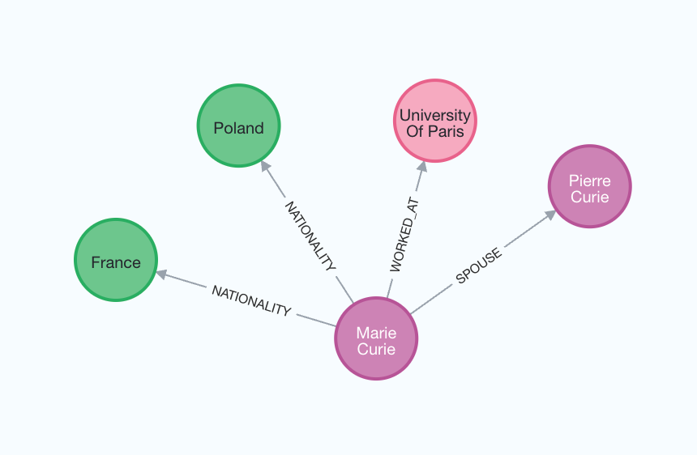

---

sidebar_position: 4

---

# 如何构建知识图谱

在本指南中，我们将介绍基于非结构化文本构建知识图谱的基本方法。构建的图谱可以作为 RAG 应用程序中的知识库使用。

## ⚠️ 安全提示 ⚠️

构建知识图谱需要对数据库执行写入访问权限。这样做存在固有风险。在导入数据之前，请确保验证和验证数据。有关一般安全最佳实践的更多信息，请[参见此处](/docs/security)。

## 架构

从文本构建知识的步骤如下：

1. **从文本中提取结构化信息**：使用模型从文本中提取结构化图信息。

2. **存储到图数据库**：将提取的结构化图信息存储到图数据库中，以便在下游 RAG 应用程序中使用。

## 设置

首先，获取所需的软件包并设置环境变量。

在本示例中，我们将使用 Neo4j 图数据库。

```python
%pip install --upgrade --quiet langchain langchain-community langchain-openai langchain-experimental neo4j
```

```output
注意：您可能需要重新启动内核以使用更新后的软件包。
```

在本指南中，我们默认使用 OpenAI 模型。

```python
import getpass
import os
os.environ["OPENAI_API_KEY"] = getpass.getpass()
# 取消下面的注释以使用 LangSmith。非必需。
# os.environ["LANGCHAIN_API_KEY"] = getpass.getpass()
# os.environ["LANGCHAIN_TRACING_V2"] = "true"
```

```output
········
```

接下来，我们需要定义 Neo4j 凭据和连接。

请按照[这些安装步骤](https://neo4j.com/docs/operations-manual/current/installation/)设置 Neo4j 数据库。

```python
import os
from langchain_community.graphs import Neo4jGraph
os.environ["NEO4J_URI"] = "bolt://localhost:7687"
os.environ["NEO4J_USERNAME"] = "neo4j"
os.environ["NEO4J_PASSWORD"] = "password"
graph = Neo4jGraph()
```

## LLM 图转换器

从文本中提取图数据使得将非结构化信息转换为结构化格式成为可能，有助于更深入地了解和更高效地浏览复杂关系和模式。`LLMGraphTransformer`通过利用 LLM 解析和分类实体及其关系，将文本文档转换为结构化图文档。LLM 模型的选择显著影响输出，因为它决定了提取的图数据的准确性和细微差别。

```python
import os
from langchain_experimental.graph_transformers import LLMGraphTransformer
from langchain_openai import ChatOpenAI
llm = ChatOpenAI(temperature=0, model_name="gpt-4-turbo")
llm_transformer = LLMGraphTransformer(llm=llm)
```

现在，我们可以传入示例文本并检查结果。

```python
from langchain_core.documents import Document
text = """
Marie Curie，出生于1867年，是一位波兰裔法国物理学家和化学家，开展了关于放射性的开创性研究。
她是第一位获得诺贝尔奖的女性，也是第一个两次获得诺贝尔奖的人，也是唯一一位在两个科学领域获得诺贝尔奖的人。
她的丈夫皮埃尔·居里与她共同获得了她的第一个诺贝尔奖，使他们成为第一个获得诺贝尔奖的夫妇，并开启了居里家族五次获得诺贝尔奖的传奇。
1906年，她成为巴黎大学的第一位女教授。
"""
documents = [Document(page_content=text)]
graph_documents = llm_transformer.convert_to_graph_documents(documents)
print(f"Nodes:{graph_documents[0].nodes}")
print(f"Relationships:{graph_documents[0].relationships}")
```

```output
Nodes:[Node(id='Marie Curie', type='Person'), Node(id='Pierre Curie', type='Person'), Node(id='University Of Paris', type='Organization')]
Relationships:[Relationship(source=Node(id='Marie Curie', type='Person'), target=Node(id='Pierre Curie', type='Person'), type='MARRIED'), Relationship(source=Node(id='Marie Curie', type='Person'), target=Node(id='University Of Paris', type='Organization'), type='PROFESSOR')]
```

查看以下图片以更好地理解生成的知识图谱的结构。


请注意，由于我们使用 LLM，图构建过程是非确定性的。因此，每次执行可能会得到略有不同的结果。

此外，您可以根据需求灵活定义要提取的节点和关系的特定类型。

```python
llm_transformer_filtered = LLMGraphTransformer(
    llm=llm,
    allowed_nodes=["Person", "Country", "Organization"],
    allowed_relationships=["NATIONALITY", "LOCATED_IN", "WORKED_AT", "SPOUSE"],
)
graph_documents_filtered = llm_transformer_filtered.convert_to_graph_documents(documents)
print(f"Nodes:{graph_documents_filtered[0].nodes}")
print(f"Relationships:{graph_documents_filtered[0].relationships}")
```

```output
节点：[节点(id='玛丽·居里', 类型='人物'), 节点(id='皮埃尔·居里', 类型='人物'), 节点(id='巴黎大学', 类型='组织')]
关系：[关系(源节点=节点(id='玛丽·居里', 类型='人物'), 目标节点=节点(id='皮埃尔·居里', 类型='人物'), 类型='配偶'), 关系(源节点=节点(id='玛丽·居里', 类型='人物'), 目标节点=节点(id='巴黎大学', 类型='组织'), 类型='工作于')]
```

为了更好地理解生成的图，我们可以再次进行可视化。



`node_properties` 参数使得可以提取节点属性，从而创建更详细的图。

当设置为 `True` 时，LLM 可以自动识别并提取相关的节点属性。

相反，如果将 `node_properties` 定义为字符串列表，则 LLM 仅从文本中选择性地检索指定的属性。

```python
llm_transformer_props = LLMGraphTransformer(
    llm=llm,
    allowed_nodes=["Person", "Country", "Organization"],
    allowed_relationships=["NATIONALITY", "LOCATED_IN", "WORKED_AT", "SPOUSE"],
    node_properties=["born_year"],
)
graph_documents_props = llm_transformer_props.convert_to_graph_documents(documents)
print(f"Nodes:{graph_documents_props[0].nodes}")
print(f"Relationships:{graph_documents_props[0].relationships}")
```

```output
节点：[节点(id='玛丽·居里', 类型='人物', 属性={'born_year': '1867'}), 节点(id='皮埃尔·居里', 类型='人物'), 节点(id='巴黎大学', 类型='组织')]
关系：[关系(源节点=节点(id='玛丽·居里', 类型='人物'), 目标节点=节点(id='皮埃尔·居里', 类型='人物'), 类型='配偶'), 关系(源节点=节点(id='玛丽·居里', 类型='人物'), 目标节点=节点(id='巴黎大学', 类型='组织'), 类型='工作于')]
```

## 存储到图数据库

生成的图文档可以使用 `add_graph_documents` 方法存储到图数据库中。

```python
graph.add_graph_documents(graph_documents_props)
```