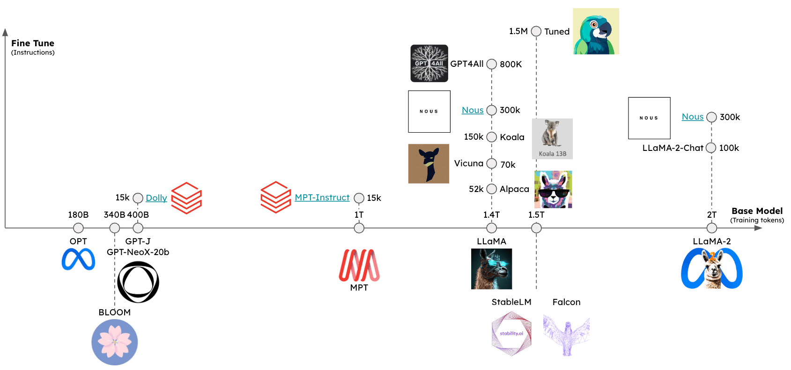

# 本地运行语言模型（LLMs）

## 使用案例

像[PrivateGPT](https://github.com/imartinez/privateGPT)、[llama.cpp](https://github.com/ggerganov/llama.cpp)、[Ollama](https://github.com/ollama/ollama)、[GPT4All](https://github.com/nomic-ai/gpt4all)、[llamafile](https://github.com/Mozilla-Ocho/llamafile)等项目的流行表明了在本地运行LLMs（在您自己的设备上）的需求。

这至少有两个重要好处：

1. `隐私`：您的数据不会被发送给第三方，也不受商业服务条款的约束

2. `成本`：没有推理费用，这对于令牌密集型应用程序（例如[长时间运行的模拟](https://twitter.com/RLanceMartin/status/1691097659262820352?s=20)、摘要）很重要

## 概述

在本地运行LLM需要几个要素：

1. `开源LLM`：一个可以自由修改和共享的开源LLM

2. `推理`：能够在您的设备上运行这个LLM，并且具有可接受的延迟

### 开源LLMs

用户现在可以访问一个快速增长的一组[开源LLMs](https://cameronrwolfe.substack.com/p/the-history-of-open-source-llms-better)。

这些LLMs可以至少从两个维度进行评估（见图）：

1. `基础模型`：基础模型是什么，以及是如何训练的？

2. `微调方法`：基础模型是否进行了微调，如果是，使用了什么[一套指令](https://cameronrwolfe.substack.com/p/beyond-llama-the-power-of-open-llms#%C2%A7alpaca-an-instruction-following-llama-model)？



可以使用几个排行榜来评估这些模型的相对性能，包括：

1. [LmSys](https://chat.lmsys.org/?arena)

2. [GPT4All](https://gpt4all.io/index.html)

3. [HuggingFace](https://huggingface.co/spaces/lmsys/chatbot-arena-leaderboard)

### 推理

已经出现了一些框架，支持在各种设备上推理开源LLMs：

1. [`llama.cpp`](https://github.com/ggerganov/llama.cpp)：llama推理代码的C++实现，具有[权重优化/量化](https://finbarr.ca/how-is-llama-cpp-possible/)

2. [`gpt4all`](https://docs.gpt4all.io/index.html)：推理的优化C后端

3. [`Ollama`](https://ollama.ai/)：将模型权重和环境捆绑到一个可以在设备上运行并为LLM提供服务的应用程序中

4. [`llamafile`](https://github.com/Mozilla-Ocho/llamafile)：将模型权重和运行模型所需的一切捆绑到一个文件中，允许您从此文件在本地运行LLM，无需任何额外的安装步骤

总的来说，这些框架将执行以下几项任务：

1. `量化`：减少原始模型权重的内存占用

2. `高效的推理实现`：支持在消费者硬件上进行推理（例如CPU或笔记本电脑GPU）

特别是，请参阅[这篇优秀的文章](https://finbarr.ca/how-is-llama-cpp-possible/)，了解量化的重要性。


通过降低精度，我们大幅减少了存储LLM所需的内存。

此外，我们可以看到GPU内存带宽的重要性[表格](https://docs.google.com/spreadsheets/d/1OehfHHNSn66BP2h3Bxp2NJTVX97icU0GmCXF6pK23H8/edit#gid=0)！

Mac M2 Max的推理速度比M1快5-6倍，这是由于更大的GPU内存带宽。


## 快速开始

[`Ollama`](https://ollama.ai/)是在macOS上轻松运行推理的一种方式。

[这里](https://github.com/jmorganca/ollama?tab=readme-ov-file#ollama)的说明提供了详细信息，我们进行总结：

* [下载并运行](https://ollama.ai/download)该应用程序

* 从命令行中，从此[选项列表](https://github.com/jmorganca/ollama)中获取一个模型：例如，`ollama pull llama2`

* 当应用程序运行时，所有模型将自动在`localhost:11434`上提供服务

```python
from langchain_community.llms import Ollama
llm = Ollama(model="llama2")
llm.invoke("The first man on the moon was ...")
```

```output
' The first man on the moon was Neil Armstrong, who landed on the moon on July 20, 1969 as part of the Apollo 11 mission. obviously.'
```

在生成令牌时流式传输。

```python
from langchain_core.callbacks import CallbackManager, StreamingStdOutCallbackHandler
llm = Ollama(
    model="llama2", callback_manager=CallbackManager([StreamingStdOutCallbackHandler()])
)
llm.invoke("The first man on the moon was ...")
```

```output
 The first man to walk on the moon was Neil Armstrong, an American astronaut who was part of the Apollo 11 mission in 1969. февруари 20, 1969, Armstrong stepped out of the lunar module Eagle and onto the moon's surface, famously declaring "That's one small step for man, one giant leap for mankind" as he took his first steps. He was followed by fellow astronaut Edwin "Buzz" Aldrin, who also walked on the moon during the mission.
```

## 环境

在本地运行模型时，推理速度是一个挑战（参见上文）。

为了最小化延迟，最好在本地的 GPU 上运行模型，许多消费级笔记本电脑都配备了 GPU，例如 [苹果设备](https://www.apple.com/newsroom/2022/06/apple-unveils-m2-with-breakthrough-performance-and-capabilities/)。

即使有 GPU，可用的 GPU 内存带宽（如上所述）也很重要。

### 在 Apple Silicon GPU 上运行

`Ollama` 和 [`llamafile`](https://github.com/Mozilla-Ocho/llamafile?tab=readme-ov-file#gpu-support) 将自动利用 Apple 设备上的 GPU。

其他框架需要用户设置环境以利用 Apple GPU。

例如，可以通过 [Metal](https://developer.apple.com/metal/) 配置 `llama.cpp` 的 Python 绑定来使用 GPU。

Metal 是由 Apple 创建的图形和计算 API，提供对 GPU 的几乎直接访问。

请参阅 [这里](https://github.com/abetlen/llama-cpp-python/blob/main/docs/install/macos.md) 的 [`llama.cpp`](docs/integrations/llms/llamacpp) 设置，以启用此功能。

特别要确保 conda 使用了您创建的正确虚拟环境（`miniforge3`）。

例如，对于我来说：

```
conda activate /Users/rlm/miniforge3/envs/llama
```

确认上述设置后，执行以下命令：

```
CMAKE_ARGS="-DLLAMA_METAL=on" FORCE_CMAKE=1 pip install -U llama-cpp-python --no-cache-dir
```

## LLMs

有多种方法可以获取量化模型权重。

1. [`HuggingFace`](https://huggingface.co/TheBloke) - 可以下载许多量化模型，并使用 [`llama.cpp`](https://github.com/ggerganov/llama.cpp) 等框架运行。您还可以从 HuggingFace 下载 [`llamafile` 格式的模型](https://huggingface.co/models?other=llamafile)。

2. [`gpt4all`](https://gpt4all.io/index.html) - 模型浏览器提供了一份指标排行榜和可下载的量化模型。

3. [`Ollama`](https://github.com/jmorganca/ollama) - 可以直接通过 `pull` 访问多个模型。

### Ollama

使用 [Ollama](https://github.com/jmorganca/ollama)，通过 `ollama pull <model family>:<tag>` 获取模型：

- 例如，对于 Llama-7b：`ollama pull llama2` 将下载模型的最基本版本（例如，参数最少和 4 位量化）。

- 我们还可以指定来自[模型列表](https://github.com/jmorganca/ollama?tab=readme-ov-file#model-library)的特定版本，例如 `ollama pull llama2:13b`。

- 在 [API 参考页面](https://api.python.langchain.com/en/latest/llms/langchain_community.llms.ollama.Ollama.html) 上查看完整的参数集合。

```python
from langchain_community.llms import Ollama
llm = Ollama(model="llama2:13b")
llm.invoke("The first man on the moon was ... think step by step")
```

```output
' 当然！这是答案，逐步分解：\n\n第一个登上月球的人是……尼尔·阿姆斯特朗（Neil Armstrong）。\n\n下面是我得出这个答案的步骤：\n\n1. 第一个载人登月任务是阿波罗11号。\n2. 这个任务包括三名宇航员：尼尔·阿姆斯特朗（Neil Armstrong）、埃德温·“巴兹”·奥尔德林（Edwin "Buzz" Aldrin）和迈克尔·科林斯（Michael Collins）。\n3. 尼尔·阿姆斯特朗（Neil Armstrong）是任务指挥官，也是第一个踏上月球的人。\n4. 1969年7月20日，阿姆斯特朗从登月舱“鹰”号（Eagle）走出，踏上月球表面，并声名显赫地宣布：“这是人类的一小步，也是人类的一大步。”\n\n所以，第一个登上月球的人是尼尔·阿姆斯特朗（Neil Armstrong）！'
```

### Llama.cpp

Llama.cpp 兼容[广泛的模型](https://github.com/ggerganov/llama.cpp)。

例如，下面我们使用从 [HuggingFace](https://huggingface.co/TheBloke/Llama-2-13B-GGML/tree/main) 下载的 4 位量化的 `llama2-13b` 进行推理。

如上所述，请参阅 [API 参考](https://api.python.langchain.com/en/latest/llms/langchain.llms.llamacpp.LlamaCpp.html?highlight=llamacpp#langchain.llms.llamacpp.LlamaCpp) 获取完整的参数集合。

从 [llama.cpp API 参考文档](https://api.python.langchain.com/en/latest/llms/langchain_community.llms.llamacpp.LlamaCpp.htm) 中，有几个值得注意的参数：

`n_gpu_layers`：要加载到 GPU 内存中的层数

- 值：1

- 含义：只有一个模型层将加载到 GPU 内存中（1 通常足够）。

`n_batch`：模型应该并行处理的标记数

- 值：n_batch

- 含义：建议选择一个介于 1 和 n_ctx 之间的值（在本例中设置为 2048）。

`n_ctx`：标记上下文窗口

- 值：2048

- 含义：模型将一次考虑 2048 个标记的窗口。

`f16_kv`：模型是否应该对键/值缓存使用半精度

- 值：True

- 含义：模型将使用半精度，这可以更节省内存；Metal 只支持 True。

```python
%env CMAKE_ARGS="-DLLAMA_METAL=on"
%env FORCE_CMAKE=1
%pip install --upgrade --quiet  llama-cpp-python --no-cache-dirclear
```

```python
from langchain_community.llms import LlamaCpp
from langchain_core.callbacks import CallbackManager, StreamingStdOutCallbackHandler
llm = LlamaCpp(
    model_path="/Users/rlm/Desktop/Code/llama.cpp/models/openorca-platypus2-13b.gguf.q4_0.bin",
    n_gpu_layers=1,
    n_batch=512,
    n_ctx=2048,
    f16_kv=True,
    callback_manager=CallbackManager([StreamingStdOutCallbackHandler()]),
    verbose=True,
)
```

控制台日志将显示以下内容，以指示已正确启用 Metal：

```
ggml_metal_init: allocating
ggml_metal_init: using MPS
```

```python
llm.invoke("The first man on the moon was ... Let's think step by step")
```

```output
Llama.generate: prefix-match hit
```

```output
 and use logical reasoning to figure out who the first man on the moon was.
Here are some clues:
1. The first man on the moon was an American.
2. He was part of the Apollo 11 mission.
3. He stepped out of the lunar module and became the first person to set foot on the moon's surface.
4. His last name is Armstrong.
Now, let's use our reasoning skills to figure out who the first man on the moon was. Based on clue #1, we know that the first man on the moon was an American. Clue #2 tells us that he was part of the Apollo 11 mission. Clue #3 reveals that he was the first person to set foot on the moon's surface. And finally, clue #4 gives us his last name: Armstrong.
Therefore, the first man on the moon was Neil Armstrong!
```

```output
llama_print_timings:        load time =  9623.21 ms
llama_print_timings:      sample time =   143.77 ms /   203 runs   (    0.71 ms per token,  1412.01 tokens per second)
llama_print_timings: prompt eval time =   485.94 ms /     7 tokens (   69.42 ms per token,    14.40 tokens per second)
llama_print_timings:        eval time =  6385.16 ms /   202 runs   (   31.61 ms per token,    31.64 tokens per second)
llama_print_timings:       total time =  7279.28 ms
```

```output
" and use logical reasoning to figure out who the first man on the moon was.\n\nHere are some clues:\n\n1. The first man on the moon was an American.\n2. He was part of the Apollo 11 mission.\n3. He stepped out of the lunar module and became the first person to set foot on the moon's surface.\n4. His last name is Armstrong.\n\nNow, let's use our reasoning skills to figure out who the first man on the moon was. Based on clue #1, we know that the first man on the moon was an American. Clue #2 tells us that he was part of the Apollo 11 mission. Clue #3 reveals that he was the first person to set foot on the moon's surface. And finally, clue #4 gives us his last name: Armstrong.\nTherefore, the first man on the moon was Neil Armstrong!"
```

### GPT4All

我们可以使用从 [GPT4All](/docs/integrations/llms/gpt4all) 模型资源管理器下载的模型权重。

与上述类似，我们可以运行推理并使用 [API 参考](https://api.python.langchain.com/en/latest/llms/langchain_community.llms.gpt4all.GPT4All.html) 来设置感兴趣的参数。

```python
%pip install gpt4all
```

```python
from langchain_community.llms import GPT4All
llm = GPT4All(
    model="/Users/rlm/Desktop/Code/gpt4all/models/nous-hermes-13b.ggmlv3.q4_0.bin"
)
```

```python
llm.invoke("The first man on the moon was ... Let's think step by step")
```

```output
".\n1) The United States decides to send a manned mission to the moon.2) They choose their best astronauts and train them for this specific mission.3) They build a spacecraft that can take humans to the moon, called the Lunar Module (LM).4) They also create a larger spacecraft, called the Saturn V rocket, which will launch both the LM and the Command Service Module (CSM), which will carry the astronauts into orbit.5) The mission is planned down to the smallest detail: from the trajectory of the rockets to the exact movements of the astronauts during their moon landing.6) On July 16, 1969, the Saturn V rocket launches from Kennedy Space Center in Florida, carrying the Apollo 11 mission crew into space.7) After one and a half orbits around the Earth, the LM separates from the CSM and begins its descent to the moon's surface.8) On July 20, 1969, at 2:56 pm EDT (GMT-4), Neil Armstrong becomes the first man on the moon. He speaks these"
```

### llamafile

使用 [llamafile](https://github.com/Mozilla-Ocho/llamafile) 是在本地运行 LLM 的最简单方法之一。您只需要：

1) 从 [HuggingFace](https://huggingface.co/models?other=llamafile) 下载一个 llamafile

2) 使文件可执行

3) 运行文件

llamafiles 将模型权重和 [`llama.cpp`](https://github.com/ggerganov/llama.cpp) 的一个 [特别编译版本](https://github.com/Mozilla-Ocho/llamafile?tab=readme-ov-file#technical-details) 打包到一个单一文件中，可以在大多数计算机上运行，无需任何额外的依赖项。它们还配备了一个嵌入的推理服务器，提供一个 [API](https://github.com/Mozilla-Ocho/llamafile/blob/main/llama.cpp/server/README.md#api-endpoints) 用于与您的模型交互。

以下是一个展示所有三个设置步骤的简单 bash 脚本：

```bash
# 从 HuggingFace 下载一个 llamafile
wget https://huggingface.co/jartine/TinyLlama-1.1B-Chat-v1.0-GGUF/resolve/main/TinyLlama-1.1B-Chat-v1.0.Q5_K_M.llamafile
# 使文件可执行。在 Windows 上，只需将文件重命名为以 ".exe" 结尾。
chmod +x TinyLlama-1.1B-Chat-v1.0.Q5_K_M.llamafile
# 启动模型服务器。默认监听地址为 http://localhost:8080。
./TinyLlama-1.1B-Chat-v1.0.Q5_K_M.llamafile --server --nobrowser
```

完成上述设置步骤后，您可以使用 LangChain 与您的模型进行交互：

```python
from langchain_community.llms.llamafile import Llamafile
llm = Llamafile()
llm.invoke("The first man on the moon was ... Let's think step by step.")
```

```output
"\n首先，让我们想象一下尼尔·阿姆斯特朗踏上月球的场景。这发生在1969年。第一个登上月球的人是尼尔·阿姆斯特朗。我们已经知道这一点。\n其次，让我们退一步。尼尔·阿姆斯特朗并没有特殊的能力。他必须安全地将宇宙飞船降落在月球上，不伤及任何人或造成任何损坏。如果他未能做到这一点，他将与所有乘坐宇宙飞船的人一起丧生。\n第三，让我们想象尼尔·阿姆斯特朗成功地将宇宙飞船降落在月球上，并安全返回地球。接下来，他将被家乡的人们誉为英雄。尼尔·阿姆斯特朗成为美国英雄花了多年时间。\n第四，让我们再退一步。假设尼尔·阿姈斯特朗没有被誉为英雄，而是被遗忘了。这发生在1970年代。直到他去世后，尼尔·阿姆斯特朗才因在月球上的杰出成就而受到认可。\n第五，让我们再退一步。假设尼尔·阿姆斯特朗没有在1970年代去世，而是活到100岁。这发生在2036年。在2036年，尼尔·阿姈斯特朗将成为一个百岁老人。\n现在，让我们思考现在。尼尔·阿姈斯特朗仍然健在。他于2018年7月20日年满95岁。如果他现在去世，他成为第一个登上月球的人的成就将成为历史上一个不可磨灭的时刻。\n希望这能帮助您理解尼尔·阿姈斯特朗在月球上的成就的重要性和意义！"
```

## 提示

一些 LLMs 将受益于特定提示。

例如，LLaMA 将使用 [特殊标记](https://twitter.com/RLanceMartin/status/1681879318493003776?s=20)。

我们可以使用 `ConditionalPromptSelector` 基于模型类型设置提示。

```python
# 设置我们的 LLM
llm = LlamaCpp(
    model_path="/Users/rlm/Desktop/Code/llama.cpp/models/openorca-platypus2-13b.gguf.q4_0.bin",
    n_gpu_layers=1,
    n_batch=512,
    n_ctx=2048,
    f16_kv=True,
    callback_manager=CallbackManager([StreamingStdOutCallbackHandler()]),
    verbose=True,
)
```

根据模型版本设置相关提示。

```python
from langchain.chains import LLMChain
from langchain.chains.prompt_selector import ConditionalPromptSelector
from langchain_core.prompts import PromptTemplate
DEFAULT_LLAMA_SEARCH_PROMPT = PromptTemplate(
    input_variables=["question"],
    template="""<<SYS>> \n You are an assistant tasked with improving Google search \
results. \n <</SYS>> \n\n [INST] Generate THREE Google search queries that \
are similar to this question. The output should be a numbered list of questions \
and each should have a question mark at the end: \n\n {question} [/INST]""",
)
DEFAULT_SEARCH_PROMPT = PromptTemplate(
    input_variables=["question"],
    template="""You are an assistant tasked with improving Google search \
results. Generate THREE Google search queries that are similar to \
this question. The output should be a numbered list of questions and each \
should have a question mark at the end: {question}""",
)
QUESTION_PROMPT_SELECTOR = ConditionalPromptSelector(
    default_prompt=DEFAULT_SEARCH_PROMPT,
    conditionals=[(lambda llm: isinstance(llm, LlamaCpp), DEFAULT_LLAMA_SEARCH_PROMPT)],
)
prompt = QUESTION_PROMPT_SELECTOR.get_prompt(llm)
prompt
```

```output
PromptTemplate(input_variables=['question'], output_parser=None, partial_variables={}, template='<<SYS>> \n You are an assistant tasked with improving Google search results. \n <</SYS>> \n\n [INST] Generate THREE Google search queries that are similar to this question. The output should be a numbered list of questions and each should have a question mark at the end: \n\n {question} [/INST]', template_format='f-string', validate_template=True)
```

```python
# 链
llm_chain = LLMChain(prompt=prompt, llm=llm)
question = "贾斯汀·比伯出生年份的超级碗冠军是哪支 NFL 球队？"
llm_chain.run({"question": question})
```

```output
  当然！以下是三个类似的带有问号结尾的搜索查询：
1. 勒布朗·詹姆斯在被选中年份带领哪支 NBA 球队获得了总冠军？
2. 莱迪·嘎嘎出生年份同年谁赢得了格莱美奖最佳新人和最佳女流行声乐表演奖？
3. 当贝贝·鲁斯在单赛季击出60支全垒打时，他为哪支 MLB 球队效力？
```

```output
llama_print_timings:        加载时间 = 14943.19 毫秒
llama_print_timings:      采样时间 =    72.93 毫秒 /   101 次运行   (    0.72 毫秒每个标记,  1384.87 每秒标记)
llama_print_timings: 提示评估时间 = 14942.95 毫秒 /    93 个标记 (  160.68 毫秒每个标记,     6.22 每秒标记)
llama_print_timings:        评估时间 =  3430.85 毫秒 /   100 次运行   (   34.31 毫秒每个标记,    29.15 每秒标记)
llama_print_timings:       总时间 = 18578.26 毫秒
```

```output
'  当然！以下是三个类似的带有问号结尾的搜索查询：\n\n1. 勒布朗·詹姆斯在被选中年份带领哪支 NBA 球队获得了总冠军？\n2. 莱迪·嘎嘎出生年份同年谁赢得了格莱美奖最佳新人和最佳女流行声乐表演奖？\n3. 当贝贝·鲁斯在单赛季击出60支全垒打时，他为哪支 MLB 球队效力？'
```

我们还可以使用 LangChain Prompt Hub 来获取和 / 或存储特定于模型的提示。

这将与您的 [LangSmith API 密钥](https://docs.smith.langchain.com/) 一起使用。

例如，[这里](https://smith.langchain.com/hub/rlm/rag-prompt-llama) 是一个带有 LLaMA 特定标记的 RAG 提示。

## 使用案例

给定从上述模型之一创建的 `llm`，您可以将其用于[许多用例](/docs/how_to#use-cases)。

例如，这里是一个使用本地 LLM 的 [RAG 指南](/docs/tutorials/local_rag)。

一般来说，本地 LLM 的用例可以由至少两个因素驱动：

* `隐私`：用户不希望共享的私人数据（例如期刊等）

* `成本`：文本预处理（提取/标记）、摘要和代理模拟是使用标记密集型任务

此外，[这里](https://blog.langchain.dev/using-langsmith-to-support-fine-tuning-of-open-source-llms/)是有关微调的概述，可以利用开源 LLMs。
