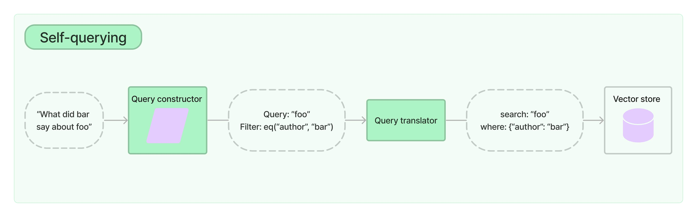

# 如何进行“自查询”检索
:::info
请访问[集成](/docs/integrations/retrievers/self_query)以获取内置自查询支持的向量存储的文档。
:::
自查询检索器是指具有自我查询能力的检索器。具体而言，给定任何自然语言查询，检索器使用查询构造的 LLM 链来编写结构化查询，然后将该结构化查询应用于其底层的向量存储。这使得检索器不仅可以使用用户输入的查询与存储文档的内容进行语义相似性比较，还可以从用户查询中提取存储文档的元数据的过滤器并执行这些过滤器。

## 入门指南
为了演示目的，我们将使用 `Chroma` 向量存储。我们创建了一个包含电影摘要的小型演示文档集。
**注意：**自查询检索器需要您安装 `lark` 包。
```python
%pip install --upgrade --quiet lark langchain-chroma
```
```python
from langchain_chroma import Chroma
from langchain_core.documents import Document
from langchain_openai import OpenAIEmbeddings
docs = [
    Document(
        page_content="一群科学家复活了恐龙，然后造成了混乱",
        metadata={"year": 1993, "rating": 7.7, "genre": "科幻"},
    ),
    Document(
        page_content="莱昂纳多·迪卡普里奥迷失在一个梦中的梦中的梦中...",
        metadata={"year": 2010, "director": "克里斯托弗·诺兰", "rating": 8.2},
    ),
    Document(
        page_content="一位心理学家/侦探迷失在一系列梦中的梦中的梦中，电影《盗梦空间》重复了这个想法",
        metadata={"year": 2006, "director": "今敏", "rating": 8.6},
    ),
    Document(
        page_content="一群普通身材的女性非常纯真，一些男性对她们心生爱慕之情",
        metadata={"year": 2019, "director": "格蕾塔·葛韦格", "rating": 8.3},
    ),
    Document(
        page_content="玩具们活了起来，并且玩得很开心",
        metadata={"year": 1995, "genre": "动画"},
    ),
    Document(
        page_content="三个人走进区域，三个人走出区域",
        metadata={"year": 1979, "director": "安德烈·塔可夫斯基", "genre": "惊悚", "rating": 9.9},
    ),
]
vectorstore = Chroma.from_documents(docs, OpenAIEmbeddings())
```
### 创建自查询检索器
现在我们可以实例化我们的检索器了。为此，我们需要提供关于我们的文档支持的元数据字段的一些信息以及文档内容的简短描述。
```python
from langchain.chains.query_constructor.base import AttributeInfo
from langchain.retrievers.self_query.base import SelfQueryRetriever
from langchain_openai import ChatOpenAI
metadata_field_info = [
    AttributeInfo(
        name="genre",
        description="电影的类型。其中之一：['科幻', '喜剧', '剧情', '惊悚', '爱情', '动作', '动画']",
        type="字符串",
    ),
    AttributeInfo(
        name="year",
        description="电影的发行年份",
        type="整数",
    ),
    AttributeInfo(
        name="director",
        description="电影导演的姓名",
        type="字符串",
    ),
    AttributeInfo(
        name="rating",
        description="电影的评分（1-10）",
        type="浮点数",
    ),
]
document_content_description = "电影的简要摘要"
llm = ChatOpenAI(temperature=0)
retriever = SelfQueryRetriever.from_llm(
    llm,
    vectorstore,
    document_content_description,
    metadata_field_info,
)
```
### 测试一下
现在我们可以尝试使用我们的检索器了！
```python
# 这个例子只指定了一个过滤器
retriever.invoke("我想看一部评分高于8.5的电影")
```
```output
[Document(page_content='三个人走进区域，三个人走出区域', metadata={'director': '安德烈·塔可夫斯基', 'genre': '惊悚', 'rating': 9.9, 'year': 1979}),
 Document(page_content='一位心理学家/侦探迷失在一系列梦中的梦中的梦中，电影《盗梦空间》重复了这个想法', metadata={'director': '今敏', 'rating': 8.6, 'year': 2006})]
```
```python
# 这个例子指定了一个查询和一个过滤器
retriever.invoke("格蕾塔·葛韦格导演过关于女性的电影吗")
```
```output
[Document(page_content='一群普通身材的女性非常纯真，一些男性对她们心生爱慕之情', metadata={'director': '格蕾塔·葛韦格', 'rating': 8.3, 'year': 2019})]
```
```python
# 这个例子指定了一个复合过滤器
retriever.invoke("有没有评分高于8.5的科幻电影？")
```
```output
[Document(page_content='一位心理学家/侦探迷失在一系列梦中的梦中的梦中，电影《盗梦空间》重复了这个想法', metadata={'director': '今敏', 'rating': 8.6, 'year': 2006}),
 Document(page_content='三个人走进区域，三个人走出区域', metadata={'director': '安德烈·塔可夫斯基', 'genre': '惊悚', 'rating': 9.9, 'year': 1979})]
```
```python
# 这个例子指定了一个查询和复合过滤器
retriever.invoke(
    "1990年之后但2005年之前关于玩具的电影，最好是动画片"
)
```
```output
[Document(page_content='玩具活了起来，尽情玩耍', metadata={'genre': '动画', '年份': 1995})]
```
### 过滤器 k
我们还可以使用自查询检索器来指定 `k`：要获取的文档数量。
我们可以通过将 `enable_limit=True` 传递给构造函数来实现这一点。
```python
retriever = SelfQueryRetriever.from_llm(
    llm,
    vectorstore,
    document_content_description,
    metadata_field_info,
    enable_limit=True,
)
# 这个例子只指定了一个相关查询
retriever.invoke("关于恐龙的两部电影是什么")
```
```output
[Document(page_content='一群科学家复活了恐龙，混乱不断', metadata={'genre': '科幻', '评分': 7.7, '年份': 1993}),
 Document(page_content='玩具活了起来，尽情玩耍', metadata={'genre': '动画', '年份': 1995})]
```
## 使用 LCEL 从头开始构建
为了了解内部运作情况，并且拥有更多自定义控制，我们可以从头开始重建我们的检索器。
首先，我们需要创建一个查询构建链。这个链将接受用户查询并生成一个 `StructuredQuery` 对象，其中包含用户指定的过滤器。我们提供了一些辅助函数来创建提示和输出解析器。这些函数有许多可调参数，为了简单起见，我们将在这里忽略它们。
```python
from langchain.chains.query_constructor.base import (
    StructuredQueryOutputParser,
    get_query_constructor_prompt,
)
prompt = get_query_constructor_prompt(
    document_content_description,
    metadata_field_info,
)
output_parser = StructuredQueryOutputParser.from_components()
query_constructor = prompt | llm | output_parser
```
让我们看看我们的提示：
```python
print(prompt.format(query="虚拟问题"))
```
```output
您的目标是结构化用户的查询，以匹配下面提供的请求模式。
<< 结构化请求模式 >>
在回复时，请使用一个 JSON 对象格式化的 markdown 代码片段。
```json
{
    "query": string \ 用于与文档内容进行比较的文本字符串
    "filter": string \ 用于过滤文档的逻辑条件语句
}
```
查询字符串应仅包含预期与文档内容匹配的文本。任何过滤器中的条件也不应在查询中提及。
逻辑条件语句由一个或多个比较和逻辑操作语句组成。
比较语句采用以下形式：`comp(attr, val)`:
- `comp` (eq | ne | gt | gte | lt | lte | contain | like | in | nin): 比较器
- `attr` (string):  应用比较的属性名称
- `val` (string): 比较值
逻辑操作语句采用以下形式 `op(statement1, statement2, ...)`:
- `op` (and | or | not): 逻辑运算符
- `statement1`, `statement2`, ... (比较语句或逻辑操作语句): 一个或多个要应用操作的语句
请确保仅使用上述列出的比较器和逻辑运算符，不要使用其他的。
请确保过滤器仅引用数据源中存在的属性。
请确保过滤器仅在属性名称后跟随其函数名称（如果对它们应用了函数）。
请确保过滤器仅在处理日期数据类型值时使用格式 `YYYY-MM-DD`。
请确保过滤器考虑属性描述，并仅进行可能的比较，考虑到存储数据类型。
请确保只在需要时使用过滤器。如果没有应用任何过滤器，请为过滤器值返回“NO_FILTER”。
<< 示例 1. >>
数据源:
```json
{
    "content": "一首歌的歌词",
    "attributes": {
        "artist": {
            "type": "string",
            "description": "歌曲艺术家的姓名"
        },
        "length": {
            "type": "integer",
            "description": "歌曲长度（秒）"
        },
        "genre": {
            "type": "string",
            "description": "歌曲流派，为 "pop", "rock" 或 "rap" 之一"
        }
    }
}
```
用户查询:
泰勒·斯威夫特或凯蒂·佩里演唱的关于青少年浪漫情感的歌曲，时长不超过3分钟，流派为舞蹈流行
结构化请求:
```json
{
    "query": "青少年之爱",
    "filter": "and(or(eq(\"artist\", \"泰勒·斯威夫特\"), eq(\"artist\", \"凯蒂·佩里\")), lt(\"length\", 180), eq(\"genre\", \"pop\"))"
}
```
<< 示例 2. >>
数据源:
```json
{
    "content": "一首歌的歌词",
    "attributes": {
        "artist": {
            "type": "string",
            "description": "歌曲艺术家的姓名"
        },
        "length": {
            "type": "integer",
            "description": "歌曲长度（秒）"
        },
        "genre": {
            "type": "string",
            "description": "歌曲流派，为 "pop", "rock" 或 "rap" 之一"
        }
    }
} 
```
```
用户查询：
哪些歌曲没有在 Spotify 上发布
结构化请求：
```json
{
    "query": "",
    "filter": "NO_FILTER"
}
```
<< 示例 3. >>
数据源：
```json
{
    "content": "Brief summary of a movie",
    "attributes": {
    "genre": {
        "description": "电影的类型。其中之一为 ['science fiction', 'comedy', 'drama', 'thriller', 'romance', 'action', 'animated']",
        "type": "string"
    },
    "year": {
        "description": "电影发布的年份",
        "type": "integer"
    },
    "director": {
        "description": "电影导演的姓名",
        "type": "string"
    },
    "rating": {
        "description": "电影的评分，范围为1-10",
        "type": "float"
    }
}
}
```
用户查询：
虚拟问题
结构化请求：
以及我们的完整链路产生的结果：
```python
query_constructor.invoke(
    {
        "query": "What are some sci-fi movies from the 90's directed by Luc Besson about taxi drivers"
    }
)
```
```output
StructuredQuery(query='taxi driver', filter=Operation(operator=<Operator.AND: 'and'>, arguments=[Comparison(comparator=<Comparator.EQ: 'eq'>, attribute='genre', value='science fiction'), Operation(operator=<Operator.AND: 'and'>, arguments=[Comparison(comparator=<Comparator.GTE: 'gte'>, attribute='year', value=1990), Comparison(comparator=<Comparator.LT: 'lt'>, attribute='year', value=2000)]), Comparison(comparator=<Comparator.EQ: 'eq'>, attribute='director', value='Luc Besson')]), limit=None)
```
查询构造器是自查询检索器的关键元素。要创建一个出色的检索系统，您需要确保查询构造器能够正常工作。通常这需要调整提示、提示中的示例、属性描述等。有关在一些酒店库存数据上完善查询构造器的示例，请参阅[此手册](https://github.com/langchain-ai/langchain/blob/master/cookbook/self_query_hotel_search.ipynb)。
下一个关键元素是结构化查询转换器。这个对象负责将通用的 `StructuredQuery` 对象转换为您正在使用的向量存储语法中的元数据过滤器。LangChain 配备了许多内置的转换器。要查看它们，请前往[集成部分](/docs/integrations/retrievers/self_query)。
```python
from langchain.retrievers.self_query.chroma import ChromaTranslator
retriever = SelfQueryRetriever(
    query_constructor=query_constructor,
    vectorstore=vectorstore,
    structured_query_translator=ChromaTranslator(),
)
```
```python
retriever.invoke(
    "What's a movie after 1990 but before 2005 that's all about toys, and preferably is animated"
)
```
```output
[Document(page_content='Toys come alive and have a blast doing so', metadata={'genre': 'animated', 'year': 1995})]
```
```