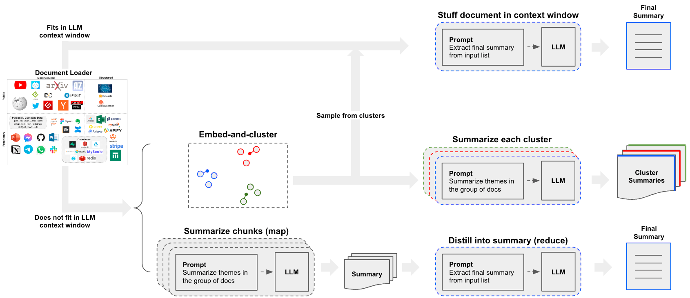

---

title: Summarize Text

sidebar_class_name: hidden

---

# 文本摘要

假设你有一组文档（PDF、Notion 页面、客户问题等），想要对内容进行摘要。

鉴于语言模型在理解和综合文本方面的高效能力，LLM 是一个很好的工具。

在[检索增强生成](/docs/tutorials/rag)的背景下，对文本进行摘要可以帮助梳理大量检索到的文档信息，为 LLM 提供上下文。

在本教程中，我们将介绍如何使用LLM对多个文档的内容进行摘要。


## 概念

我们将涵盖的概念有：

- 使用[语言模型](/docs/concepts/#chat-models)。

- 使用[文档加载器](/docs/concepts/#document-loaders)，特别是[WebBaseLoader](https://api.python.langchain.com/en/latest/document_loaders/langchain_community.document_loaders.web_base.WebBaseLoader.html)，用于从 HTML 网页加载内容。

- 三种摘要或其他方式合并文档的方法：

  1. [Stuff](/docs/tutorials/summarization#stuff)，简单地将文档连接成一个提示；

  2. [Map-reduce](/docs/tutorials/summarization#map-reduce)，将文档分成批次进行摘要，然后对这些摘要进行总结；

  3. [Refine](/docs/tutorials/summarization#refine)，通过迭代文档序列来更新滚动摘要。

这是需要涵盖的内容！让我们开始吧。

## 设置

### Jupyter Notebook

本指南（以及文档中的大多数其他指南）使用[Jupyter 笔记本](https://jupyter.org/)，并假定读者也在使用。Jupyter 笔记本非常适合学习如何使用LLM系统，因为通常会出现问题（意外输出、API 崩溃等），在交互式环境中阅读指南是更好地理解它们的好方法。

这个教程和其他教程可能最方便在 Jupyter 笔记本中运行。请参阅[这里](https://jupyter.org/install)获取安装说明。

### 安装

要安装 LangChain，请运行：

import Tabs from '@theme/Tabs';

import TabItem from '@theme/TabItem';

import CodeBlock from "@theme/CodeBlock";

<Tabs>

  <TabItem value="pip" label="Pip" default>

    <CodeBlock language="bash">pip install langchain</CodeBlock>

  </TabItem>

  <TabItem value="conda" label="Conda">

    <CodeBlock language="bash">conda install langchain -c conda-forge</CodeBlock>

  </TabItem>

</Tabs>

更多详情，请参阅我们的[安装指南](/docs/how_to/installation)。

### LangSmith

使用 LangChain 构建的许多应用程序将包含多个步骤，需要多次调用LLM。

随着这些应用程序变得越来越复杂，能够检查链或代理内部发生的情况变得至关重要。

最好的方法是使用[LangSmith](https://smith.langchain.com)。

在上面的链接注册后，请确保设置您的环境变量以开始记录跟踪：

```shell
export LANGCHAIN_TRACING_V2="true"
export LANGCHAIN_API_KEY="..."
```

或者，在笔记本中，您可以使用以下方式设置：

```python
import getpass
import os
os.environ["LANGCHAIN_TRACING_V2"] = "true"
os.environ["LANGCHAIN_API_KEY"] = getpass.getpass()
```

## 概览

构建摘要器的一个核心问题是如何将文档传递到LLM的上下文窗口中。这方面的三种常见方法是：

1. `Stuff`：简单地将所有文档“填入”单个提示中。这是最简单的方法（请参阅[这里](/docs/tutorials/rag#built-in-chains)了解用于此方法的`create_stuff_documents_chain`构造函数）。

2. `Map-reduce`：在“映射”步骤中单独总结每个文档，然后将这些摘要“减少”为最终摘要（请参阅[这里](https://api.python.langchain.com/en/latest/chains/langchain.chains.combine_documents.map_reduce.MapReduceDocumentsChain.html)了解用于此方法的`MapReduceDocumentsChain`）。

3. `Refine`：通过迭代文档序列来更新滚动摘要。


## 快速开始

为了让您有一个预览，任一流水线都可以封装在一个单个对象中：`load_summarize_chain`。

假设我们想要总结一篇博客文章。我们可以用几行代码来创建它。

首先设置环境变量并安装软件包：

```python
%pip install --upgrade --quiet  langchain-openai tiktoken chromadb langchain
# Set env var OPENAI_API_KEY or load from a .env file
# import dotenv
# dotenv.load_dotenv()
```

如果使用较大上下文窗口模型，可以使用`chain_type="stuff"`，特别是：

- 128k token OpenAI `gpt-4-turbo-2024-04-09`

- 200k token Anthropic `claude-3-sonnet-20240229`

我们还可以提供 `chain_type="map_reduce"` 或 `chain_type="refine"`。

首先，我们加载我们的文档。我们将使用 [WebBaseLoader](https://api.python.langchain.com/en/latest/document_loaders/langchain_community.document_loaders.web_base.WebBaseLoader.html) 来加载一篇博客文章：

```python
import os
os.environ["LANGCHAIN_TRACING_V2"] = "True"
```

```python
from langchain.chains.summarize import load_summarize_chain
from langchain_community.document_loaders import WebBaseLoader
from langchain_openai import ChatOpenAI
loader = WebBaseLoader("https://lilianweng.github.io/posts/2023-06-23-agent/")
docs = loader.load()
llm = ChatOpenAI(temperature=0, model_name="gpt-3.5-turbo-1106")
chain = load_summarize_chain(llm, chain_type="stuff")
result = chain.invoke(docs)
print(result["output_text"])
```

```output
该文章讨论了以LLM为动力的自主代理的概念，重点关注规划、记忆和工具使用的组成部分。它包括案例研究和概念验证示例，以及相关研究的挑战和参考文献。作者强调了LLM在创建强大的问题解决代理方面的潜力，同时也强调了有限的上下文长度和自然语言界面的可靠性等局限性。
```

## 选项 1. Stuff {#stuff}

当我们使用 `load_summarize_chain` 与 `chain_type="stuff"` 时，我们将使用 [StuffDocumentsChain](https://api.python.langchain.com/en/latest/chains/langchain.chains.combine_documents.stuff.StuffDocumentsChain.html#langchain.chains.combine_documents.stuff.StuffDocumentsChain)。

该链将接受一个文档列表，将它们全部插入一个提示中，并将该提示传递给一个LLM：

```python
from langchain.chains.combine_documents.stuff import StuffDocumentsChain
from langchain.chains.llm import LLMChain
from langchain_core.prompts import PromptTemplate
# 定义提示
prompt_template = """Write a concise summary of the following:
"{text}"
CONCISE SUMMARY:"""
prompt = PromptTemplate.from_template(prompt_template)
# 定义LLM链
llm = ChatOpenAI(temperature=0, model_name="gpt-3.5-turbo-16k")
llm_chain = LLMChain(llm=llm, prompt=prompt)
# 定义StuffDocumentsChain
stuff_chain = StuffDocumentsChain(llm_chain=llm_chain, document_variable_name="text")
docs = loader.load()
print(stuff_chain.invoke(docs)["output_text"])
```

```output
该文章讨论了以大型语言模型（LLMs）为动力的自主代理的概念。它探讨了这些代理的组成部分，包括规划、记忆和工具使用。文章提供了案例研究和概念验证演示的示例，强调了LLM动力代理的挑战和局限性。它还包括了相关研究论文和项目的参考资料。
```

太棒了！我们可以看到，我们使用 `load_summarize_chain` 重新产生了之前的结果。

### 深入了解

* 您可以轻松定制提示。

* 您可以轻松尝试不同的LLMs（例如，通过 `llm` 参数使用 [Claude](/docs/integrations/chat/anthropic)）。

## 选项 2. Map-Reduce {#map-reduce}

让我们解开map-reduce方法。为此，我们将首先使用 `LLMChain` 将每个文档映射到一个单独的摘要。然后，我们将使用 `ReduceDocumentsChain` 将这些摘要组合成一个全局摘要。

首先，我们指定用于将每个文档映射到单独摘要的 `LLMChain`：

```python
from langchain.chains import MapReduceDocumentsChain, ReduceDocumentsChain
from langchain_text_splitters import CharacterTextSplitter
llm = ChatOpenAI(temperature=0)
# Map
map_template = """The following is a set of documents
{docs}
Based on this list of docs, please identify the main themes 
Helpful Answer:"""
map_prompt = PromptTemplate.from_template(map_template)
map_chain = LLMChain(llm=llm, prompt=map_prompt)
```

我们还可以使用Prompt Hub来存储和获取提示。

这将与您的 [LangSmith API key](https://docs.smith.langchain.com/) 一起使用。

例如，查看此处的map提示 [here](https://smith.langchain.com/hub/rlm/map-prompt)。

```python
from langchain import hub
map_prompt = hub.pull("rlm/map-prompt")
map_chain = LLMChain(llm=llm, prompt=map_prompt)
```

`ReduceDocumentsChain` 处理将文档映射结果减少为单个输出。它包装了一个通用的 `CombineDocumentsChain`（例如 `StuffDocumentsChain`），但如果它们的累积大小超过 `token_max`，则添加了将文档折叠后传递给 `CombineDocumentsChain` 的能力。在这个例子中，我们实际上可以重复使用我们用于组合文档的链来折叠我们的文档。

所以，如果我们映射文档中的累积标记数超过4000个标记，那么我们将递归地将文档分批传递给我们的`StuffDocumentsChain`，以创建批量摘要。一旦这些批量摘要的累积标记少于4000个，我们将最后一次将它们全部传递给`StuffDocumentsChain`，以创建最终摘要。

```python
# Reduce
reduce_template = """以下是一组摘要：
{docs}
将这些内容提炼成最终的、综合的主题摘要。
有用的回答："""
reduce_prompt = PromptTemplate.from_template(reduce_template)
```

```python
# 注意，我们也可以从 prompt hub 获取这个模板，如上所述
reduce_prompt = hub.pull("rlm/map-prompt")
```

```python
reduce_prompt
```

```output
ChatPromptTemplate(input_variables=['docs'], metadata={'lc_hub_owner': 'rlm', 'lc_hub_repo': 'map-prompt', 'lc_hub_commit_hash': 'de4fba345f211a462584fc25b7077e69c1ba6cdcf4e21b7ec9abe457ddb16c87'}, messages=[HumanMessagePromptTemplate(prompt=PromptTemplate(input_variables=['docs'], template='以下是一组文档：\n{docs}\n请根据这些文档列出主题摘要\n有用的回答：'))])
```

```python
# 运行链
reduce_chain = LLMChain(llm=llm, prompt=reduce_prompt)
# 接受一个文档列表，将它们组合成一个字符串，并将其传递给 LLMChain
combine_documents_chain = StuffDocumentsChain(
    llm_chain=reduce_chain, document_variable_name="docs"
)
# 组合并逐步减少映射的文档
reduce_documents_chain = ReduceDocumentsChain(
    # 这是最后调用的链。
    combine_documents_chain=combine_documents_chain,
    # 如果文档超过 `StuffDocumentsChain` 的上下文
    collapse_documents_chain=combine_documents_chain,
    # 将文档分组的最大标记数。
    token_max=4000,
)
```

将我们的映射和减少链合并为一个：

```python
# 通过映射链将文档组合起来，然后组合结果
map_reduce_chain = MapReduceDocumentsChain(
    # 映射链
    llm_chain=map_chain,
    # 减少链
    reduce_documents_chain=reduce_documents_chain,
    # 将文档放入 llm_chain 中的变量名
    document_variable_name="docs",
    # 在输出中返回映射步骤的结果
    return_intermediate_steps=False,
)
text_splitter = CharacterTextSplitter.from_tiktoken_encoder(
    chunk_size=1000, chunk_overlap=0
)
split_docs = text_splitter.split_documents(docs)
```

```output
创建了一个大小为1003的块，超过了指定的1000
```

```python
result = map_reduce_chain.invoke(split_docs)
print(result["output_text"])
```

```output
在提供的文档列表中，识别出的主要主题与大型语言模型（LLMs）、自主代理、提示、引导语言模型、自然语言处理（NLP）、使用工具增强语言模型、强化学习、推理、行动、自我反思以及将语言模型与外部知识源整合相关。
```

如果我们按照[Langsmith Trace](https://smith.langchain.com/public/3a1a6d51-68e5-4805-8d90-78920ce60a51/r)的步骤，我们可以看到单个LLM摘要，包括[最终调用](https://smith.langchain.com/public/69482813-f0b7-46b0-a99f-86d56fc9644a/r)，该调用总结了这些摘要。

### 深入了解

**自定义**

- 如上所示，您可以自定义映射和减少阶段的LLMs和提示。

**实际应用**

- 请参阅[此博客文章](https://blog.langchain.dev/llms-to-improve-documentation/)中关于分析用户交互（关于LangChain文档的问题）的案例研究！

- 该博客文章和相关的[存储库](https://github.com/mendableai/QA_clustering)还介绍了聚类作为摘要的一种手段。

- 这打开了除了`stuff`或`map-reduce`方法之外的另一条值得考虑的路径。



## 选项3. 细化 {#refine}

[RefineDocumentsChain](https://api.python.langchain.com/en/latest/chains/langchain.chains.combine_documents.refine.RefineDocumentsChain.html)与map-reduce类似：

> 细化文档链通过循环遍历输入文档并迭代更新其答案来构建响应。对于每个文档，它将所有非文档输入、当前文档和最新的中间答案传递给LLM链，以获得新的答案。

可以通过指定`chain_type="refine"`来轻松运行。

```python
chain = load_summarize_chain(llm, chain_type="refine")
result = chain.invoke(split_docs)
print(result["output_text"])
```

```output
现有摘要通过代码实现项目架构提供了详细的说明，重点是按照所选语言和框架的最佳实践，在不同文件中创建核心类、函数和方法。还概述了模型、视图和控制器组件的假设。额外的上下文突出了长期规划和任务分解中的挑战，以及LLM驱动的自主代理中自然语言界面的可靠性问题。这些见解揭示了在代理系统中使用LLMs的限制和潜在陷阱，并参考了关于LLM驱动的自主代理和相关技术的最新研究。
```

根据 [Langsmith trace](https://smith.langchain.com/public/38017fa7-b190-4635-992c-e8554227a4bb/r)，我们可以看到摘要随着新信息的迭代更新。

还可以提供提示并返回中间步骤。

```python
prompt_template = """对以下内容写一个简明摘要：
{text}
简明摘要:"""
prompt = PromptTemplate.from_template(prompt_template)
refine_template = (
    "你的任务是生成最终摘要\n"
    "我们已经提供了到某个特定点的现有摘要: {existing_answer}\n"
    "我们有机会通过以下更多的上下文来完善现有摘要（只有在需要时）。\n"
    "------------\n"
    "{text}\n"
    "------------\n"
    "根据新的上下文，用意大利语完善原始摘要\n"
    "如果上下文没有用，返回原始摘要。"
)
refine_prompt = PromptTemplate.from_template(refine_template)
chain = load_summarize_chain(
    llm=llm,
    chain_type="refine",
    question_prompt=prompt,
    refine_prompt=refine_prompt,
    return_intermediate_steps=True,
    input_key="input_documents",
    output_key="output_text",
)
result = chain({"input_documents": split_docs}, return_only_outputs=True)
```

```output
/Users/chestercurme/repos/langchain/libs/core/langchain_core/_api/deprecation.py:119: LangChainDeprecationWarning: The method `Chain.__call__` was deprecated in langchain 0.1.0 and will be removed in 0.2.0. Use invoke instead.
  warn_deprecated(
```

```python
prompt_template = """对以下内容写一个简明摘要：
{text}
简明摘要:"""
prompt = PromptTemplate.from_template(prompt_template)
refine_template = (
    "你的任务是生成最终摘要\n"
    "我们已经提供了到某个特定点的现有摘要: {existing_answer}\n"
    "我们有机会通过以下更多的上下文来完善现有摘要（只有在需要时）。\n"
    "------------\n"
    "{text}\n"
    "------------\n"
    "根据新的上下文，用意大利语完善原始摘要\n"
    "如果上下文没有用，返回原始摘要。"
)
refine_prompt = PromptTemplate.from_template(refine_template)
chain = load_summarize_chain(
    llm=llm,
    chain_type="refine",
    question_prompt=prompt,
    refine_prompt=refine_prompt,
    return_intermediate_steps=True,
    input_key="input_documents",
    output_key="output_text",
)
result = chain.invoke({"input_documents": split_docs}, return_only_outputs=True)
```

```python
print(result["output_text"])
```

```output
本文讨论了使用LLM（大型语言模型）作为核心控制器构建自主代理的概念。文章探讨了由LLM驱动的代理系统的不同组成部分，包括规划、记忆和工具使用。AutoGPT等概念验证演示展示了LLM作为通用问题解决器的潜力。Chain of Thought、Tree of Thoughts、LLM+P、ReAct和Reflexion等方法使自主代理能够进行规划、自我反思并进行迭代改进。然而，仍然存在挑战，例如有限的上下文能力限制了详细历史信息的包含以及长期规划和任务分解的困难。此外，LLM与记忆和工具等外部组件之间的自然语言接口的可靠性是不确定的，因为LLM可能会出现格式错误和叛逆行为。尽管如此，AutoGPT系统被提及为使用LLM作为自主代理的主要控制器的概念验证示例。本文引用了多个来源，探讨了LLM在自主代理领域的特定方法和应用。
```

```python
print("\n\n".join(result["intermediate_steps"][:3]))
```

```output
This article discusses the concept of building autonomous agents using LLM (large language model) as the core controller. The article explores the different components of an LLM-powered agent system, including planning, memory, and tool use. It also provides examples of proof-of-concept demos and highlights the potential of LLM as a general problem solver.
Questo articolo discute del concetto di costruire agenti autonomi utilizzando LLM (large language model) come controller principale. L'articolo esplora i diversi componenti di un sistema di agenti alimentato da LLM, inclusa la pianificazione, la memoria e l'uso degli strumenti. Vengono forniti anche esempi di dimostrazioni di proof-of-concept e si evidenzia il potenziale di LLM come risolutore generale di problemi.
Questo articolo discute del concetto di costruire agenti autonomi utilizzando LLM (large language model) come controller principale. L'articolo esplora i diversi componenti di un sistema di agenti alimentato da LLM, inclusa la pianificazione, la memoria e l'uso degli strumenti. Vengono forniti anche esempi di dimostrazioni di proof-of-concept e si evidenzia il potenziale di LLM come risolutore generale di problemi. Inoltre, vengono presentati approcci come Chain of Thought, Tree of Thoughts, LLM+P, ReAct e Reflexion che consentono agli agenti autonomi di pianificare, riflettere su se stessi e migliorare iterativamente. Il nuovo contesto riguarda l'approccio Chain of Hindsight (CoH) che permette al modello di migliorare autonomamente i propri output attraverso un processo di apprendimento supervisionato. Viene anche presentato l'approccio Algorithm Distillation (AD) che applica lo stesso concetto alle traiettorie di apprendimento per compiti di reinforcement learning.
```

## 将分割和总结结合在一个单一链中

为了方便起见，我们可以将长文档的文本分割和总结包装在一个`AnalyzeDocumentsChain`中。

```python
from langchain.chains import AnalyzeDocumentChain
summarize_document_chain = AnalyzeDocumentChain(
    combine_docs_chain=chain, text_splitter=text_splitter
)
summarize_document_chain.invoke(docs[0].page_content)
```

## 下一步

我们鼓励您查看[操作指南](/docs/how_to)以获取更多关于：

- 内置[文档加载器](/docs/how_to/#document-loaders)和[文本分割器](/docs/how_to/#text-splitters)

- 将各种组合文档链集成到[RAG应用程序](/docs/tutorials/rag/)中

- 将检索整合到[聊天机器人](/docs/how_to/chatbots_retrieval/)中

以及其他概念的详细信息。